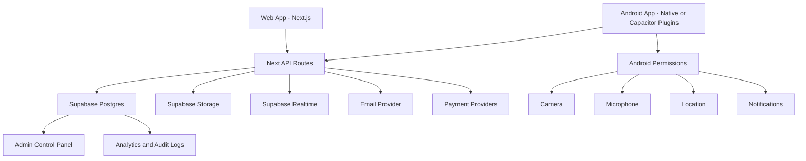

# Target Architecture

## Backend Rules

1. Server routes own privileged writes.
2. Service role keys must never be bundled into Android.
3. Public and authenticated clients only read/write through RLS-safe paths.
4. Package access must be resolved through one helper and enforced by every feature endpoint.
5. User category, looking-for label, seed category, and visibility must be stored data, not inferred from display names.

## Android Rules

1. The APK must not point at the wrong production URL.
2. Camera and microphone are requested only when the user starts live, calls, video messages, or voice notes.
3. Location is requested before nearby matching, home recommendations, members distance, or matches distance.
4. Push notifications are requested after login and stored in user settings.
5. If full native rebuild is chosen, auth, discovery, profile, chat, calls, live, packages, and admin should be implemented as native screens against the same API contract.

## Data Rules

1. Existing real users are never deleted by migrations.
2. Seed repair must be explicit and source-folder based.
3. Duplicate seed deletion must use `is_seed_profile = true` or a seed email/source marker, never name matching alone.
4. Account deletion must remove app user data and Supabase auth identity when requested by the user.
5. Deleted emails must be reusable after full account deletion.

